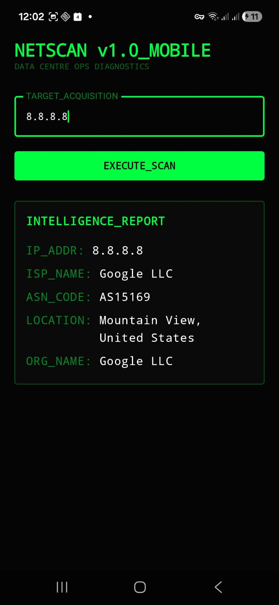
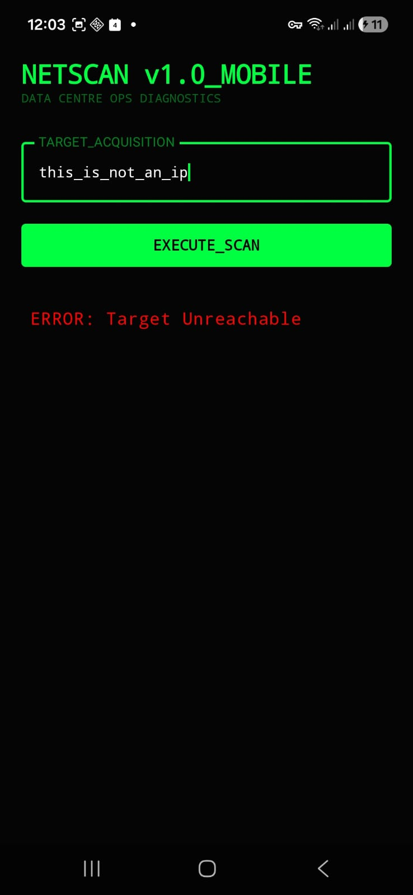

# NetScan Mobile - Data Centre Network Diagnostic Tool

## 🚀 Project Overview
**NetScan Mobile** is a native Android utility designed for Data Centre Operations (DCO) engineers. It allows for rapid on-site network reconnaissance, ISP verification, and routing diagnostics directly from a mobile device.

This tool was built to solve the challenge of performing quick network audits on the data centre floor (e.g., at iXAfrica NBOX1) without needing to carry a laptop into the cold aisle.

## 🛠 Tech Stack & Architecture
- **Language**: Kotlin
- **UI Framework**: Jetpack Compose (Modern, declarative UI)
- **Architecture**: MVVM (Model-View-ViewModel) for clean separation of concerns.
- **Networking**: Retrofit 2 + OkHttp (Industry standard for REST API integration).
- **Concurrency**: Kotlin Coroutines for non-blocking network I/O.
- **Design System**: "Cyber-Terminal" aesthetic for high-visibility in technical environments.

## 📡 Key Features
- **Target Acquisition**: Resolve any IP or Domain to its physical and logical infrastructure.
- **ISP & ASN Mapping**: Identify the upstream provider and Autonomous System Number (ASN) instantly.
- **Geo-Location**: Map the physical origin of network traffic.
- **DCO Optimized UI**: High-contrast, monospace interface designed for technical clarity.

## 📖 How it Works (Technical Flow)
1. User enters a target (IP/Domain) in the acquisition module.
2. The **ViewModel** triggers a **Coroutine** to handle the network request.
3. **Retrofit** fetches data from the `ipwhois.app` REST API.
4. Data is parsed via **Gson** and updated in the UI state.
5. The UI reactively updates to display the infrastructure details.

## 🏢 Relevance to Data Centre Operations
This project demonstrates:
- **Networking Fundamentals**: Practical application of TCP/IP, DNS, and Routing concepts.
- **Automation & Tools**: Building custom utilities to improve operational efficiency.
- **Documentation**: Clear, professional technical communication (SOP style).
- **Modern Development**: Proficiency in Kotlin and REST/JSON integrations.

## 🧪 Testing & Verification (UAT Report)

To ensure "Production Ready" status for Data Centre operations, the following tests were performed on physical hardware (**Samsung Galaxy A16**).

### 1. Primary API & Networking Test
- **Target**: `8.8.8.8` (Google DNS)
- **Result**: Successfully resolved ISP (Google LLC) and ASN (15169).
- **Verification**:
  

### 3. Error Handling & Validation
- **Target**: Invalid Input (`non_ip_target`)
- **Result**: System maintained stability; displayed "Target Unreachable" without crashing.
- **Verification**:
  

## 🛠 Installation
1. Clone this repository.
2. Open in **Android Studio Hedgehog** or newer.
3. Build and run on an emulator or physical device (API 24+).

---
*Developed by Emma Karanja.*